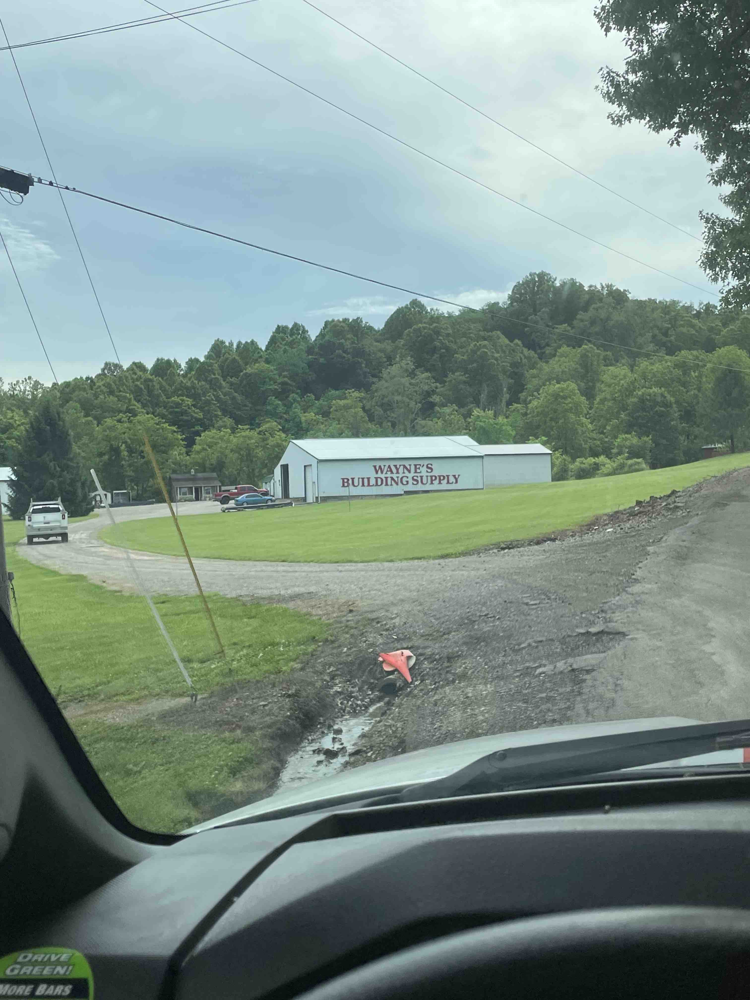
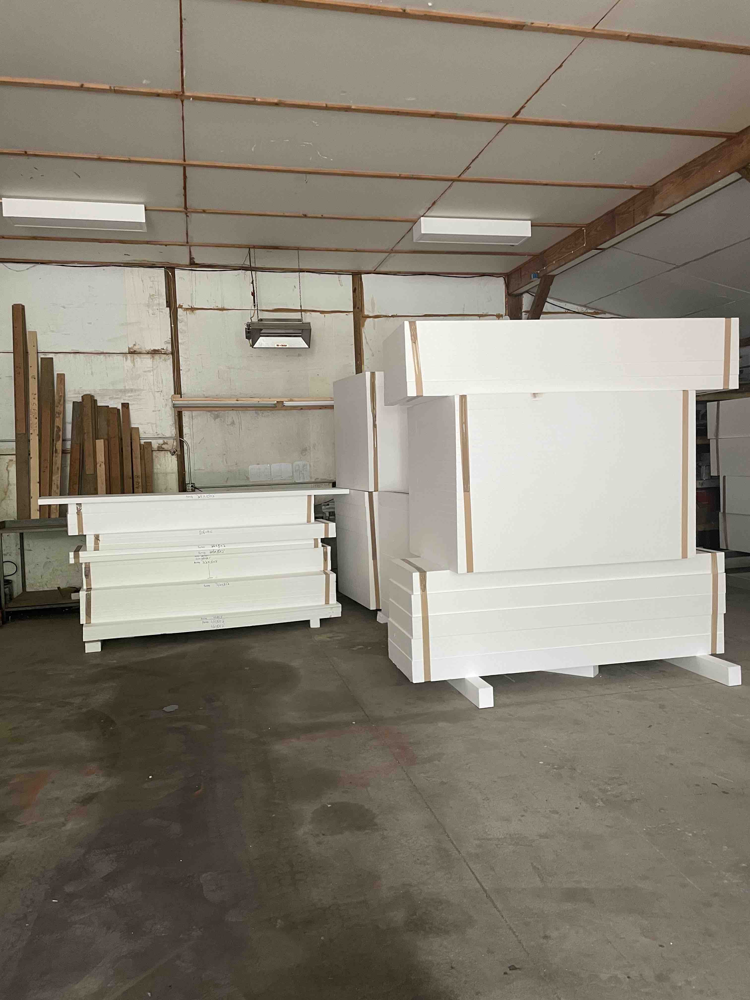
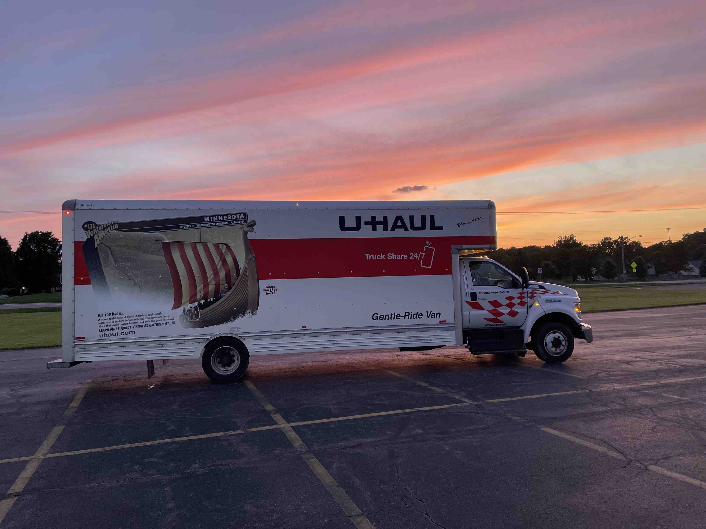
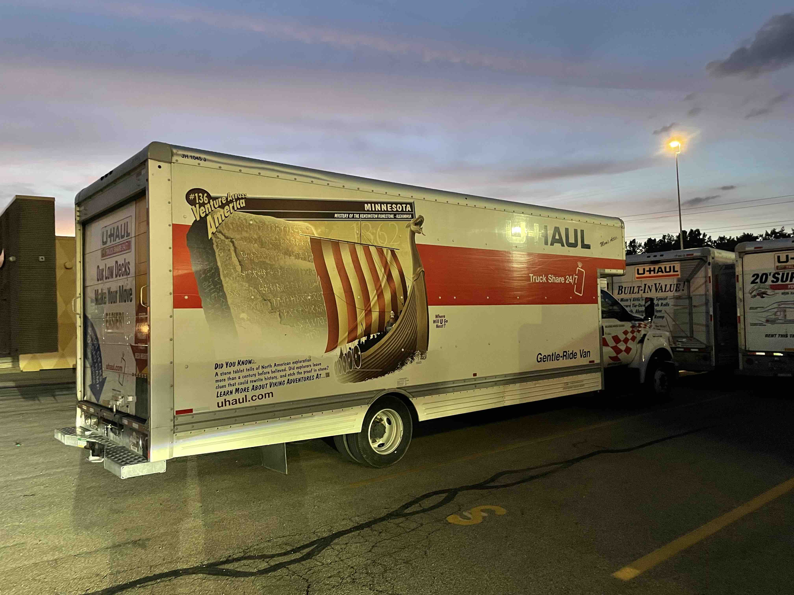

It's been a little bit since I've posted an update. At this point I have essentially every thing I need minus the PVC that I am going to get from Lowes, coatings, and geotube which is being shipped from Illinois next week. Today I picked up a 26' UHAUL full of EPS foam from Wayne's Building Supply in Laurelville Ohio.

Picking up an entire truck full of foam will overwhelm even the most confident of DIY'ers. Fortunatley this is a part of my dream and nothing will get between my and the finish line. The photos might not do it justice but a 26' foot van full of foam is a lot of foam. Here's a nice picture of the van right before the sunset.

Friends are a necessary and important part of life and unloading the van without them would have been impossible soI am grateful for them. If it wasn't clear before today has made it abundantly clear that this whole thing will not be done alone.

Steps in the short term include:

	1. Continuing hole excavation
		*I've started in the east corner and will work my way around with the trackhoe. Hydraulic lines starting leaking and cut my work short it will be an easy fix thanks to the folks on the heavy duty machinery forum (shoutout to Delmer and Tinkerer). Moments like this make me appreciate the power of the internet when used in the right way.
	2. After excavation I will need a level foundation comprised of 4" of pea gravel. 
		*If this proves to be too difficult to do by myself I have no problem calling in the professionals, but the whole point of this journey is to show anyone that they can do it by themselves and some help from loved ones. I've purchased 3 soil temperature/moisture gauges that I will lay at different levels and locations in the thermal battery to be able to measure thermodynamic action in the soil. 
	3. Coating foundation and perimeter EPS to prevent premature degredation. 
	4. PVC grid and plenum head construction. 
	5. Geotube installation
	6. Backfill and tamping. 

I'm really just focusing on the geo battery portion for now because the whole system is really comprised of 2 seperate parts that (ideally) work well together. I'm signing off for now it's late and I'm tired. You'll be hearing from me soon hopefully with good news.

11.12.22 - Holy smokes it's been about 4 months since updating this repo. After I completed excavation the soccer season began in full swing so I did not have time to work on the greenhouse. This was my first year as JV soccer coach at Alter Highschool. We had a successful season and I enjoyed it much more than I thought I would, but I definitely underestimated the time commitment. I took off this week from work to get this project back on track. I (naively) thought I'd be able to grade the bottom of the hole, place the foam, skeleton, and corrugated pipe and infill with dirt all in one week. Boy what a fool I am. This was a week of ups and downs. Learned many lessons but am looking forward to whats to come. 

I started off getting a load of pea gravel Monday morning. 

And at this point I was feeling pretty good. My pea gravel was delivered painlessley and I was getting my bobcat rental in about an hour. I could make my ramp down to the hole, grade the bottom and begin filling it back in. 

Then this happened.

If you've never gotten a bobcat stuck in the mud, I can assure you it is a pretty helpless feeling. You start to feel yourself getting stuck, then you try to get yourself unstuck. But trying to get yourself unstuck results in you getting yourself more stuck. So I'm stuck, and keep in mind this is the first time I've ever used a track loader so this is all very much uncharted territory for me. I'm thinking this could be a 6 figure mistake. In hindsight I was freaking out over nothing but in the moment I was tweaking. I did not want to call the rental place because I was embarrased and nervous what they would say. I described to him that I had a problem and he just laughed at me and basically said "If you've ever used a bobcat chances are you've gotten a bobcat stuck, call this number and they'll get you out." I called number and $560 later I was out of the mud. So monday I didn't get a ton done and basically just got myself stuck and unstuck. 

Onward and upward.  

