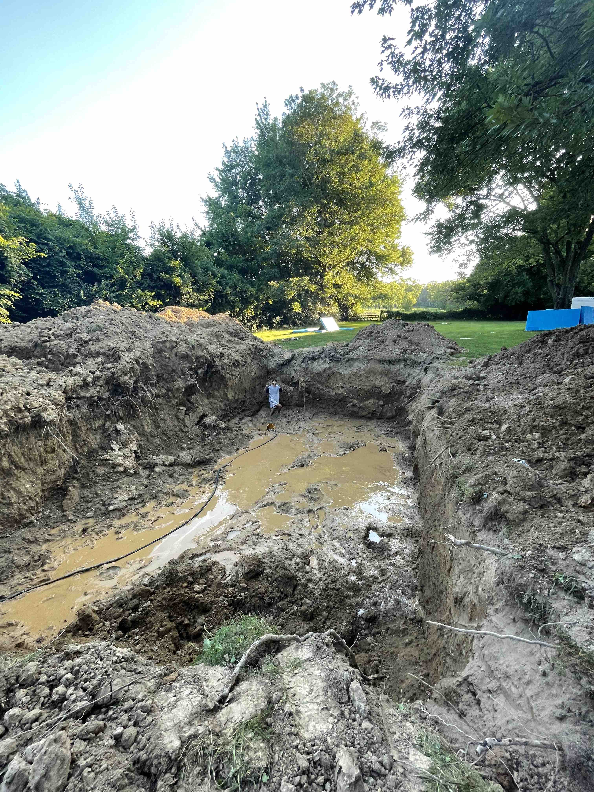

# Excavation
----

It seemed like I had 2 options to get this hole dug, rent an excavator or buy a backhoe. I decided on the latter. They both can accomplish similar work but the backhoe requires a little more time and planning.

6.22.22 - There hasn't been an update in a little bit because I've mainly just been digging and coating the EPS perimiter walls. I've got around 15x40x8.5 dug out as of today. Have a time lapse of the dig I might have to upload to youtube instead of here because of size issues. 

This was the hole on June 7th I started digging on May 30th.

Hole on June 9th

Definitely am learning how to operate the backhoe without causing massive leaks. Started running the engine at lower RPM's; it's moves slower but haven't had any downtime to retighten fittings.

Hole on July 4th

And with the closing of the holiday weekend I've finished excavation. Very worried about the next steps but I was very worred about excavating. Going to order gravel once I get the sides cleaned up.
